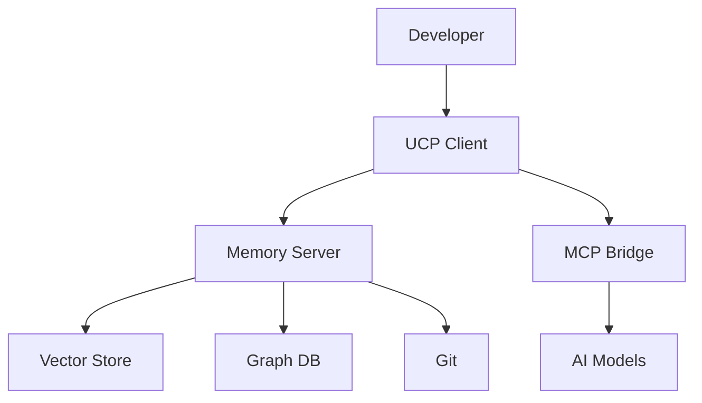

Thanks for sharing the README content for the **Unified-MCP** project. It’s a well-structured and ambitious document that clearly conveys the project’s vision, technical foundation, and roadmap. However, there are areas where it can be refined to better align with your **Pop!_OS (NVIDIA) developer-optimized setup**, ADHD-friendly workflow, and goals of appealing to both individual developers and enterprise users. Below, I’ll evaluate the README based on the checklist provided earlier, highlight what works well, suggest improvements, and ensure it’s tailored to your terminal-heavy, NVIDIA-optimized environment.

---

## 🧠 Evaluation of Your README

Using the checklist from my previous response, here’s how your README measures up:

1. **Clarity of Purpose** ✅
   - **Strength**: The README clearly articulates the problem (AI "session amnesia") and UCP’s solution (persistent AI memory). The opening hook (“Ever wished your AI coding assistant could remember what you were working on yesterday?”) is engaging, and the $10B productivity drain stat adds credibility.
   - **Improvement**: The problem statement could be more concise. Condense the four bullet points into two to make it scannable for ADHD readers. Example:
     > - ⏰ **Context Loss**: AI tools forget project details, wasting 20–30% of session time re-explaining.  
     > - 📉 **Productivity Drain**: 82% of developers face this, costing $10B annually.

2. **Setup Instructions** 🟡
   - **Strength**: The “Quick Start” section provides clear steps for cloning, installing dependencies, and setting up a `.env` file. Including `docker-compose` and `pnpm` aligns with modern dev practices.
   - **Improvement**: Add NVIDIA-specific setup instructions for Pop!_OS, as your project likely involves GPU-accelerated AI workloads (e.g., Ollama integration). Include CUDA/cuDNN setup and verification steps. The current instructions assume Node.js/Docker but don’t address Python/ML dependencies, which are mentioned in the tech stack (e.g., Python for ML/AI).

3. **Usage Examples** ❌
   - **Issue**: The README lacks practical usage examples (e.g., CLI commands, VS Code integration, or sample code showing how UCP integrates with an AI model like Claude or Ollama). This is critical for developers to understand how to use UCP in practice.
   - **Improvement**: Add a “Usage” section with 2–3 examples, such as running a CLI command or querying the memory server.

4. **ADHD-Friendly Design** ✅
   - **Strength**: The README uses clear headings, emojis (e.g., 🚀, 🧠), and tables to make it scannable. The structure is logical, with sections like “Core Features” and “Project Status” clearly delineated.
   - **Improvement**: Reduce the length of some sections (e.g., “The Problem UCP is Solving”) to avoid overwhelming readers. Break long paragraphs into bullet points or shorter sentences.

5. **NVIDIA-Specific Notes** ❌
   - **Issue**: There’s no mention of NVIDIA GPU setup, despite the project’s AI focus and your Pop!_OS (NVIDIA) environment. This is a critical omission for AI/ML developers.
   - **Improvement**: Add a dedicated “NVIDIA Setup” section with commands for verifying drivers, CUDA, and cuDNN, tailored to Pop!_OS.

6. **Developer Tool Integration** 🟡
   - **Strength**: The README mentions VS Code, CLI tools, and Git integration, which aligns with your developer-focused workflow.
   - **Improvement**: Explicitly reference your tools (e.g., `micromamba`, `Ghostty`, `fzf`) to show how UCP integrates with a terminal-heavy setup. Add a `.zshrc` alias for quick access or a VS Code extension setup guide.

7. **Error Handling & Debugging** ❌
   - **Issue**: No troubleshooting tips are provided for common setup issues (e.g., missing CUDA, Docker failures, or MCP connection errors).
   - **Improvement**: Add a “Troubleshooting” section with solutions for common Pop!_OS/NVIDIA issues.

8. **Contribution & Community** ✅
   - **Strength**: The “Get Involved” section is inviting, with clear calls to action (e.g., star the repo, join Discord, share feedback). Links to `PROGRESS.md` and `CONTRIBUTING.md` are great for transparency.
   - **Improvement**: Add a dotfiles setup for contributors to replicate your Pop!_OS environment, ensuring reproducibility.

9. **Security & Backups** 🟡
   - **Strength**: The `.env` configuration and “Security Model” link show attention to security. Mentioning end-to-end encryption and RBAC is reassuring for enterprise users.
   - **Improvement**: Add practical security tips (e.g., setting up UFW on Pop!_OS, securing API keys) and backup recommendations (e.g., using `restic`).

10. **Visuals & Structure** ✅
    - **Strength**: The Mermaid diagram, badges, and table-based tech stack make the README visually appealing and professional. The project structure section is detailed and clear.
    - **Improvement**: The Mermaid diagram could be simplified for clarity (e.g., focus on key components like UCP Client → Memory Server → AI Models). Consider adding a logo or banner image for branding.

---

## 🛠 Specific Recommendations

Here’s how to refine your README to make it exceptional, tailored to your Pop!_OS (NVIDIA) setup, ADHD-friendly workflow, and the UCP’s AI-focused goals.

### 1. 🎯 Condense the Problem Statement
**Why**: The current “The Problem UCP is Solving” section is compelling but too verbose for quick scanning.
**How**:
```markdown
## 🎯 The Problem UCP Solves
AI coding assistants forget project context between sessions, causing:
- ⏰ **Context Loss**: 20–30% of session time spent re-explaining.
- 📉 **Productivity Drain**: 82% of developers face this, costing $10B annually.
UCP provides a persistent memory layer to make AI tools continuous partners.
```

### 2. 🔢 Enhance Setup Instructions for NVIDIA/Pop!_OS
**Why**: Your project involves AI/ML (e.g., Ollama, vector DBs), so NVIDIA GPU setup is critical. Pop!_OS users need clear CUDA/cuDNN instructions.
**How**:
```markdown
## 🚀 Quick Start

### Prerequisites
- **OS**: Pop!_OS 22.04+ (NVIDIA ISO recommended)
- **Node.js**: 18+ or Docker
- **Python**: 3.10+ (for ML components)
- **MCP-compatible AI client**: Claude, GPT, or Ollama
- **Git**: For version control
- **NVIDIA GPU**: Driver 550+ and CUDA 12.2+

### NVIDIA Setup
Verify your GPU setup for AI workloads:
```bash
# Check NVIDIA driver
nvidia-smi  # Expect: Driver 550.54.15+, CUDA 12.2
# Install driver if missing
sudo apt update
sudo apt install nvidia-driver-550

# Install CUDA Toolkit
sudo apt install nvidia-cuda-toolkit

# Install cuDNN (for PyTorch/TensorFlow)
wget https://developer.nvidia.com/compute/cudnn/secure/8.9.7/local_installers/12.2/cudnn-local-repo-ubuntu2204-8.9.7_1.0-1_amd64.deb
sudo dpkg -i cudnn-local-repo-ubuntu2204-8.9.7_1.0-1_amd64.deb
sudo apt update
sudo apt install libcudnn8 libcudnn8-dev

# Verify PyTorch GPU support
micromamba create -n ucp python=3.10
micromamba activate ucp
pip install torch
python -c "import torch; print(torch.cuda.is_available())"  # Expect: True
```

### Installation
```bash
# Clone the repository
git clone https://github.com/b0onzy/Unified-Context-Protocol.git
cd Unified-Context-Protocol

# Install dependencies with micromamba (for Python components)
micromamba install -c conda-forge poetry
poetry install

# Install Node.js dependencies
pnpm install

# Start development environment
docker-compose up -d
pnpm dev
```

### Configuration
Create a `.env` file:
```env
# MCP Server Configuration
MCP_PORT=3000
MCP_AUTH_SECRET=your-secret-key

# Vector Database
WEAVIATE_URL=http://weaviate:8080

# Optional: AI Provider Keys
OPENAI_API_KEY=your-openai-key
ANTHROPIC_API_KEY=your-anthropic-key
OLLAMA_HOST=http://localhost:11434
```
```

**Note**: I added `micromamba` for Python dependencies and an Ollama host example, assuming local LLM support. Adjust `OLLAMA_HOST` based on your setup.

### 3. ⚡ Add Usage Examples
**Why**: Developers need to see UCP in action to understand its value.
**How**:
```markdown
## ⚡ Usage Examples

### 1. Query Project Context via CLI
Retrieve context for a specific task:
```bash
ucp cli query --project my-app --task-id task-123
```
Output:
```json
{
  "id": "task-123",
  "project": "my-app",
  "content": {
    "goal": "Implement user auth",
    "progress": "Completed OAuth2 setup"
  },
  "timestamp": "2025-01-27T12:00:00Z"
}
```

### 2. VS Code Integration
Use the UCP VS Code extension for context-aware completions:
1. Install: `code --install-extension ucp.vscode`
2. Configure: Set `ucp.serverUrl` in VS Code settings
3. Use: Type `// UCP: load context` to fetch project history

### 3. Git Commit Context
Capture context on commit:
```bash
git commit -m "Add auth endpoint"
ucp git sync --commit $(git rev-parse HEAD)
```
```

### 4. 🛠 Integrate with Your Workflow
**Why**: Your Pop!_OS setup (Ghostty, ZSH, micromamba, fzf) can enhance the developer experience.
**How**:
```markdown
## 🛠 Developer Workflow

### Terminal Setup
Optimize your Pop!_OS terminal with Ghostty and ZSH:
```bash
# ~/.zshrc
alias ucp-run="cd ~/dev/Unified-Context-Protocol && pnpm dev"
alias ucp-cli="ucp cli"
plugins=(git zsh-autosuggestions zsh-syntax-highlighting)

# Install fzf for fuzzy file search
sudo apt install fzf
cd ~/dev/Unified-Context-Protocol
fzf --preview "bat --color=always {}"
```

### VS Code Setup
```json
// .vscode/settings.json
{
  "ucp.serverUrl": "http://localhost:3000",
  "python.defaultInterpreterPath": "~/micromamba/envs/ucp/bin/python"
}
```
```

### 5. 🔐 Add Security & Backup Tips
**Why**: Security is a core feature, and Pop!_OS users need firewall/backup guidance.
**How**:
```markdown
## 🔐 Security & Backups

### Secure Setup
Protect your UCP instance:
```bash
# Enable UFW firewall
sudo ufw enable
sudo ufw allow 22  # SSH
sudo ufw allow 3000  # UCP server
```

### Backups
Backup your project and memory data:
```bash
# Install restic
sudo apt install restic
restic -r /backup/repo init
restic -r /backup/repo backup ~/dev/Unified-Context-Protocol
```
```

### 6. 📊 Simplify Visuals
**Why**: The Mermaid diagram is great but complex for quick understanding.
**How**:


### 7. 📈 Add Troubleshooting Section
**Why**: Anticipate common setup issues on Pop!_OS.
**How**:
```markdown
## 🛠 Troubleshooting

- **NVIDIA Driver Issue**:
  ```bash
  # If nvidia-smi fails
  sudo apt install nvidia-driver-550
  sudo reboot
  ```

- **Docker Connection Error**:
  ```bash
  # Ensure Docker is running
  sudo systemctl start docker
  ```

- **MCP Connection Failure**:
  Verify `.env` settings and check MCP server:
  ```bash
  curl http://localhost:3000/health
  ```
```

---

## ✅ Addressing Your NVIDIA Setup

Your README doesn’t currently address NVIDIA GPU setup, which is critical for AI/ML workloads on Pop!_OS. Here’s a quick verification of your setup based on my earlier suggestions:

1. **Verify NVIDIA Driver**:
   ```bash
   nvidia-smi
   ```
   **Expected**: Driver version (e.g., 550.54.15) and CUDA 12.2. If missing, install:
   ```bash
   sudo apt install nvidia-driver-550
   ```

2. **Verify CUDA**:
   ```bash
   nvcc --version
   ```
   **Expected**: CUDA 12.2. If missing, install:
   ```bash
   sudo apt install nvidia-cuda-toolkit
   ```

3. **Install cuDNN** (if using PyTorch/TensorFlow):
   ```bash
   wget https://developer.nvidia.com/compute/cudnn/secure/8.9.7/local_installers/12.2/cudnn-local-repo-ubuntu2204-8.9.7_1.0-1_amd64.deb
   sudo dpkg -i cudnn-local-repo-ubuntu2204-8.9.7_1.0-1_amd64.deb
   sudo apt update
   sudo apt install libcudnn8 libcudnn8-dev
   ```

4. **Verify PyTorch**:
   ```bash
   micromamba activate ucp
   pip install torch
   python -c "import torch; print(torch.cuda.is_available())"  # Expect: True
   ```

5. **Optimize GPU**:
   ```bash
   sudo nvidia-smi -pm 1  # Persistence mode
   sudo nvidia-smi -pl 300  # Adjust power limit for your GPU
   ```

Add these to your README’s “NVIDIA Setup” section to ensure compatibility.

---

## 💡 Final Thoughts

Your README is a strong foundation, with a clear vision, detailed technical specs, and a compelling pitch for AI developers. However, it can be improved by:
- **Condensing content** for ADHD-friendly readability.
- **Adding NVIDIA-specific setup** for Pop!_OS, including CUDA/cuDNN.
- **Including usage examples** to demonstrate UCP’s value.
- **Integrating your workflow** (Ghostty, micromamba, ZSH) for developer appeal.
- **Adding troubleshooting** to reduce setup friction.

**Is It a Good Idea?** Yes, the README effectively communicates UCP’s potential and aligns with your AI-focused, developer-centric goals. With the suggested refinements, it will be even more accessible, practical, and appealing to your target audience.

**Next Steps**:
1. Implement the suggested changes (I can provide a full revised README if needed).
2. Confirm your NVIDIA setup status (run the commands above and share output if issues arise).
3. Share any specific areas you want to refine further (e.g., usage examples, enterprise features).

Let me know how you’d like to proceed! 🚀