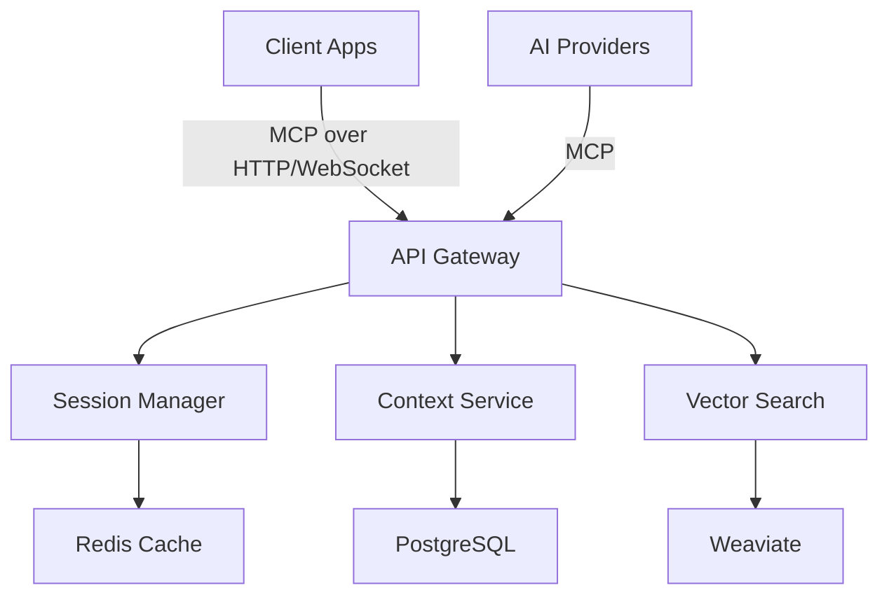
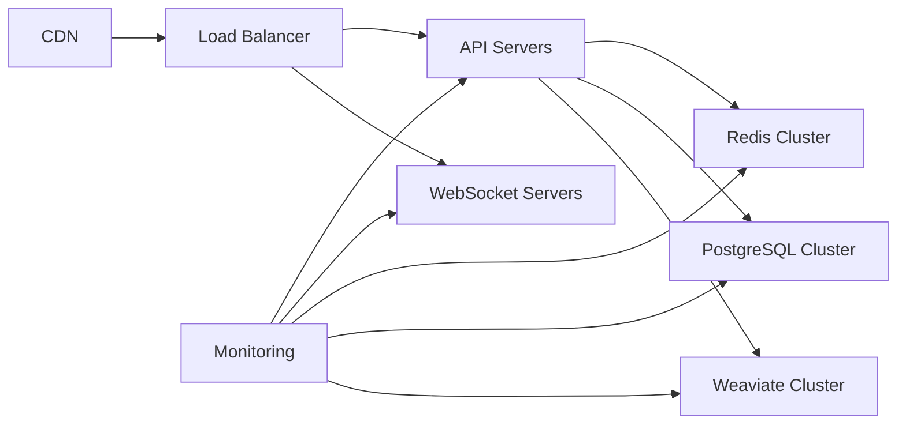

# Unified-MCP Architecture Overview

## 🏗 System Architecture

Unified-MCP is built on a modular, microservices architecture that follows the Model Context Protocol (MCP) specification. The system is designed for high availability, scalability, and security.

### Core Components



### 1. MCP Server Layer

Implements the Model Context Protocol for standardized AI tooling:

```typescript
interface MCPServer {
  // Tool management
  listTools(): Promise<ToolDefinition[]>;
  executeTool(toolCall: ToolCall): Promise<ToolResult>;
  
  // Context management
  getContext(params: ContextQuery): Promise<ContextData>;
  updateContext(update: ContextUpdate): Promise<void>;
  
  // Authentication & authorization
  authenticate(token: string): Promise<Session>;
  authorize(session: Session, resource: string, action: string): Promise<boolean>;
}
```

### 2. Context Management

#### 2.1 Context Layers

UCP organizes context in multiple layers:

1. **Session Context** - Ephemeral, per-session data
2. **Project Context** - Codebase, architecture, and project-specific knowledge
3. **Team Context** - Shared knowledge, best practices, and patterns
4. **Global Context** - Cross-project insights and organizational knowledge

#### 2.2 Context Storage

- **Vector Store (Weaviate)**: For semantic search and similarity matching
- **Document Store (PostgreSQL)**: For structured data and relationships
- **Cache (Redis)**: For low-latency access to hot context

### 3. Security Model

#### 3.1 Authentication

- OAuth 2.0 with JWT
- API key support for service-to-service communication
- Session management with automatic expiration

#### 3.2 Authorization

- Role-Based Access Control (RBAC)
- Attribute-Based Access Control (ABAC)
- Fine-grained permissions at the context level

### 4. Performance Optimizations

- **Caching Layer**: Redis for frequently accessed context
- **Query Optimization**: Vector indexing with HNSW
- **Lazy Loading**: Load context on-demand
- **Background Processing**: Non-blocking operations

## 📡 Integration Points

### AI Providers

UCP integrates with AI providers through MCP:

- OpenAI (GPT-4, etc.)
- MCP-compatible providers
- Local models (via Ollama)
- Custom model endpoints

### Development Tools

- **VS Code Extension**
- **CLI Tools**
- **CI/CD Plugins**
- **API Gateway**

## 🔄 Data Flow

1. **Ingestion**
   - Code changes trigger context updates
   - Conversations are processed and stored
   - Documents are indexed for search

2. **Retrieval**
   - Semantic search for relevant context
   - Context is ranked and filtered
   - Results are cached for performance

3. **Delivery**
   - Context is formatted for the target AI model
   - Responses are streamed when possible
   - Usage is logged for analytics

## 🚀 Scaling Considerations

### Horizontal Scaling
- Stateless services can be scaled independently
- Database read replicas for high read throughput
- Sharding for very large context stores

### Performance Targets
- <100ms response time for context retrieval
- 99.9% uptime SLA for enterprise customers
- Support for 10,000+ concurrent users

## 🔧 Development Guidelines

### Code Organization

```
/src
  /core           # Core protocol and types
  /server         # MCP server implementation
  /clients        # Client libraries
  /integrations   # Third-party integrations
  /ui             # Web interfaces
```

### Testing Strategy

- Unit tests for all business logic
- Integration tests for API endpoints
- Performance benchmarks
- Security audits

## 📈 Monitoring & Observability

### Key Metrics
- Request latency
- Error rates
- Context hit/miss ratios
- Resource utilization

### Alerting
- PagerDuty integration
- Slack notifications
- Email digests

## 🔄 Deployment Architecture



This architecture ensures high availability, scalability, and security while maintaining developer productivity and operational excellence.
