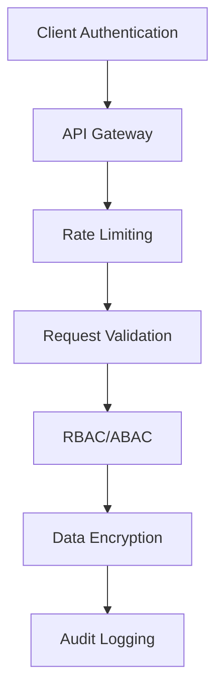

# Unified-MCP Security Best Practices

## 🔐 Security Architecture

Unified-MCP implements a defense-in-depth security strategy with multiple layers of protection:



## 🔑 Authentication & Authorization

### 1. Authentication

#### 1.1 Supported Methods

- **OAuth 2.0** (recommended for user authentication)
  - PKCE (Proof Key for Code Exchange) for public clients
  - JWT access tokens with short expiration (15-60 minutes)
  - Refresh tokens with rotation

- **API Keys** (for service-to-service)
  - Key rotation every 90 days
  - Key hashing using Argon2id
  - Rate limiting per key

#### 1.2 Session Management

```typescript
interface Session {
  id: string;
  userId: string;
  createdAt: Date;
  expiresAt: Date;
  lastUsedAt: Date;
  userAgent: string;
  ipAddress: string;
  isRevoked: boolean;
  scopes: string[];
}
```

### 2. Authorization

#### 2.1 Role-Based Access Control (RBAC)

```yaml
roles:
  - name: "admin"
    permissions:
      - "context:read"
      - "context:write"
      - "user:manage"
      - "audit:read"

  - name: "developer"
    permissions:
      - "context:read"
      - "context:write:own"
      - "project:read"

  - name: "readonly"
    permissions:
      - "context:read"
      - "project:read"
```

#### 2.2 Attribute-Based Access Control (ABAC)

```typescript
interface Policy {
  id: string;
  effect: 'allow' | 'deny';
  actions: string[];
  resources: string[];
  conditions: {
    [key: string]: any;
  };
}
```

## 🔒 Data Protection

### 1. Encryption

#### 1.1 At Rest

- **Sensitive Data**: Encrypted using AES-256-GCM
- **Encryption Keys**: Managed by AWS KMS or HashiCorp Vault
- **Key Rotation**: Automatic every 90 days

#### 1.2 In Transit

- TLS 1.3 for all communications
- HSTS (HTTP Strict Transport Security)
- Certificate pinning for mobile apps

### 2. Data Masking

```typescript
function maskSensitiveData(data: any): any {
  return {
    ...data,
    apiKey: '••••••••' + data.apiKey.slice(-4),
    password: undefined, // Never include in logs
    creditCard: data.creditCard ? '•••• •••• •••• ' + data.creditCard.slice(-4) : undefined
  };
}
```

## 🛡️ API Security

### 1. Rate Limiting

- 1000 requests/minute per IP (burst to 2000)
- 100 requests/minute per user (burst to 200)
- 10 requests/second per endpoint

### 2. Input Validation

```typescript
import { z } from 'zod';

const contextSchema = z.object({
  id: z.string().uuid(),
  content: z.string().min(1).max(10000),
  metadata: z.record(z.unknown()),
  accessControl: z.array(z.string().email())
});
```

### 3. CORS Policy

```typescript
const corsOptions = {
  origin: process.env.ALLOWED_ORIGINS?.split(','),
  methods: ['GET', 'POST', 'PUT', 'DELETE', 'OPTIONS'],
  allowedHeaders: ['Content-Type', 'Authorization'],
  maxAge: 86400,
  credentials: true
};
```

## 🕵️ Audit & Compliance

### 1. Audit Logging

```typescript
interface AuditLog {
  id: string;
  timestamp: Date;
  action: string;
  resource: string;
  resourceId: string;
  userId: string;
  userAgent: string;
  ipAddress: string;
  metadata: Record<string, unknown>;
}
```

### 2. Compliance

- **GDPR**: Right to be forgotten, data portability
- **SOC 2**: Security controls and monitoring
- **ISO 27001**: Information security management

## 🚨 Incident Response

### 1. Detection

- Real-time monitoring for suspicious activities
- Automated alerts for security events
- Regular security scanning

### 2. Response

1. **Contain**: Isolate affected systems
2. **Assess**: Determine impact and scope
3. **Mitigate**: Apply fixes and workarounds
4. **Notify**: Inform affected parties
5. **Recover**: Restore services
6. **Review**: Post-mortem analysis

## 🔄 Secure Development Lifecycle

### 1. Pre-commit Hooks

```bash
# .husky/pre-commit
#!/bin/sh
. "$(dirname "$0")/_/husky.sh"

# Run security checks
npm run lint:security
npm run audit

# Run tests
npm test
```

### 2. Dependency Scanning

```yaml
# .github/workflows/security-scan.yml
name: Security Scan

on:
  push:
    branches: [ main ]
  pull_request:
    branches: [ main ]
  schedule:
    - cron: '0 0 * * 0' # Weekly

jobs:
  security:
    runs-on: ubuntu-latest
    steps:
      - uses: actions/checkout@v3
      - name: Run npm audit
        run: npm audit --production
      - name: Run snyk test
        uses: snyk/actions/node@master
        with:
          args: --severity-threshold=high
```

## 📚 Resources

- [OWASP Top 10](https://owasp.org/www-project-top-ten/)
- [NIST Cybersecurity Framework](https://www.nist.gov/cyberframework)
- [CIS Benchmarks](https://www.cisecurity.org/cis-benchmarks/)
- [MITRE ATT&CK](https://attack.mitre.org/)

## 🔗 External Security Contacts

- **Security Team**: security@yourcompany.com
- **PGP Key**: [Link to public key]
- **Security Advisories**: [Link to security advisories page]

---

*Last Updated: 2025-07-27*
*Version: 1.0.0*
